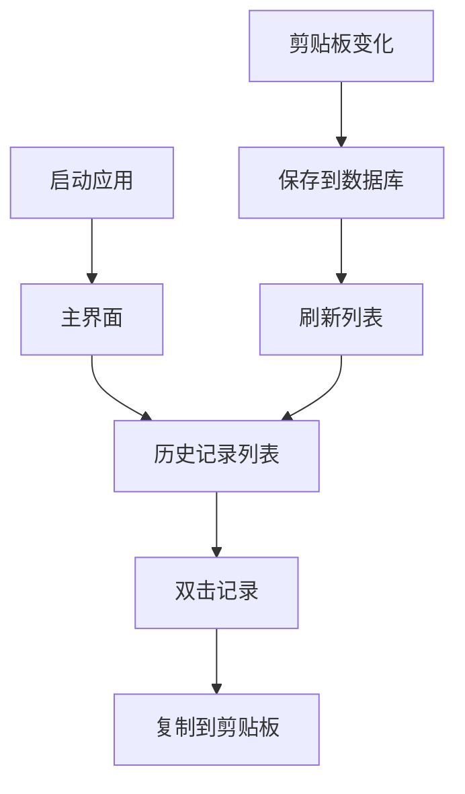

# 剪贴板历史记录应用 - 产品需求文档

## 1. 产品概述

剪贴板历史记录应用是一个基于WPF的桌面工具，用于自动记录和管理用户的剪贴板操作历史。
该应用解决了用户在日常工作中频繁复制粘贴时丢失历史内容的问题，提供便捷的历史记录查看和重用功能。
目标是提升用户的工作效率，减少重复操作，成为Windows用户必备的生产力工具。

## 2. 核心功能

### 2.1 用户角色

本应用为单用户桌面应用，无需区分用户角色。

### 2.2 功能模块

我们的剪贴板历史记录应用包含以下主要页面：

1. **主界面**：历史记录列表、操作按钮

### 2.3 页面详情

| 页面名称 | 模块名称   | 功能描述             |
| ---- | ------ | ---------------- |
| 主界面  | 历史记录列表 | 显示剪贴板历史记录，每行一条记录 |

## 3. 核心流程

**主要用户操作流程：**

1. **启动应用**：用户启动应用后，主界面显示历史记录列表
2. **自动监听**：应用在后台监听剪贴板变化事件
3. **记录保存**：检测到剪贴板内容变化时，自动将内容保存到SQLite数据库
4. **界面刷新**：数据库更新后立即刷新主界面的历史记录列表
5. **内容重用**：用户双击列表中的记录，将该内容复制到剪贴板

## 4. 用户界面设计

### 4.1 设计风格

* **主色调**：#2196F3（蓝色）、#FFFFFF（白色）

* **辅助色**：#757575（灰色）、#4CAF50（绿色）

* **按钮样式**：圆角矩形，扁平化设计

* **字体**：微软雅黑，主要文字14px，辅助文字12px

* **布局风格**：简洁的列表式布局

* **图标风格**：Material Design风格的矢量图标

### 4.2 页面设计概览

| 页面名称 | 模块名称   | UI元素                                         |
| ---- | ------ | -------------------------------------------- |
| 主界面  | 历史记录列表 | 白色背景的ListView，每行包含图标、内容预览（最多50字符）、时间戳，鼠标悬停高亮 |

### 4.3 响应式设计

应用采用桌面优先设计，支持窗口大小调整，最小窗口尺寸为400x300像素。列表项会根据窗口宽度自动调整内容显示长度。
