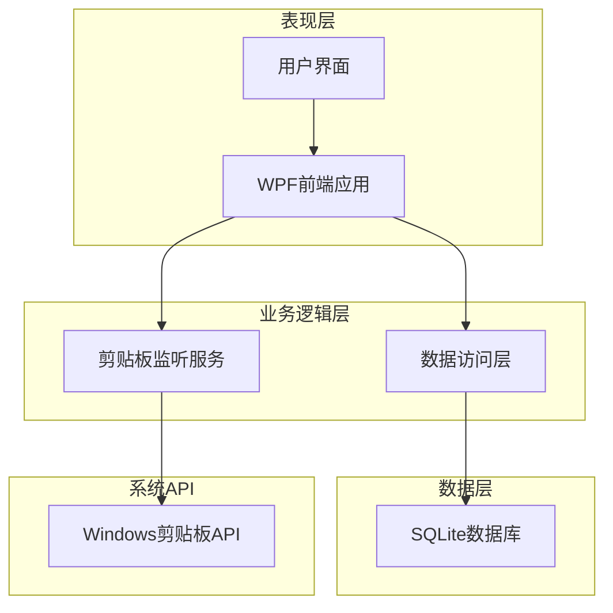
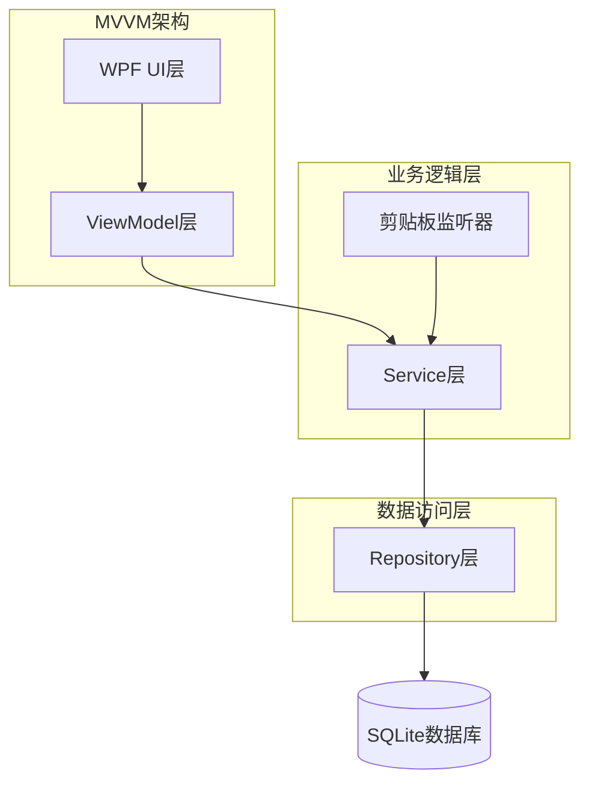
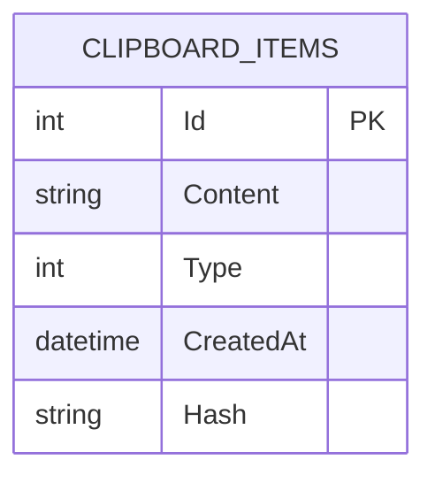

# 剪贴板历史记录应用 - 技术架构文档

## 1. 架构设计



## 2. 技术描述

* **前端框架**：WPF (.NET 8) + XAML

* **数据库**：SQLite + Entity Framework Core

* **系统集成**：Windows Clipboard API

* **UI框架**：Material Design In XAML Toolkit

## 3. 路由定义

| 路由         | 用途                   |
| ---------- | -------------------- |
| MainWindow | 主界面，显示剪贴板历史记录列表和操作按钮 |

## 4. API定义

### 4.1 核心服务接口

**剪贴板监听服务**

```csharp
public interface IClipboardService
{
    event EventHandler<ClipboardChangedEventArgs> ClipboardChanged;
    void StartMonitoring();
    void StopMonitoring();
    string GetClipboardText();
}
```

**数据访问服务**

```csharp
public interface IClipboardHistoryService
{
    Task<List<ClipboardItem>> GetHistoryAsync();
    Task<ClipboardItem> AddItemAsync(string content, ClipboardItemType type);
    Task DeleteItemAsync(int id);
    Task ClearHistoryAsync();
    Task<List<ClipboardItem>> SearchAsync(string keyword);
}
```

### 4.2 数据传输对象

**剪贴板项目**

```csharp
public class ClipboardItem
{
    public int Id { get; set; }
    public string Content { get; set; }
    public ClipboardItemType Type { get; set; }
    public DateTime CreatedAt { get; set; }
    public string Preview => Content?.Length > 50 ? Content.Substring(0, 50) + "..." : Content;
}

public enum ClipboardItemType
{
    Text,
    Image,
    File
}
```

**剪贴板变化事件参数**

```csharp
public class ClipboardChangedEventArgs : EventArgs
{
    public string Content { get; set; }
    public ClipboardItemType Type { get; set; }
    public DateTime Timestamp { get; set; }
}
```

## 5. 服务器架构图



## 6. 数据模型

### 6.1 数据模型定义



### 6.2 数据定义语言

**剪贴板历史表 (clipboard\_items)**

```sql
-- 创建表
CREATE TABLE clipboard_items (
    id INTEGER PRIMARY KEY AUTOINCREMENT,
    content TEXT NOT NULL,
    type INTEGER NOT NULL DEFAULT 0,
    created_at DATETIME NOT NULL DEFAULT CURRENT_TIMESTAMP,
    hash TEXT NOT NULL
);

-- 创建索引
CREATE INDEX idx_clipboard_items_created_at ON clipboard_items(created_at DESC);
CREATE INDEX idx_clipboard_items_hash ON clipboard_items(hash);
CREATE INDEX idx_clipboard_items_type ON clipboard_items(type);


```

**Entity Framework Core配置**

```csharp
public class ClipboardDbContext : DbContext
{
    public DbSet<ClipboardItem> ClipboardItems { get; set; }
    
    protected override void OnConfiguring(DbContextOptionsBuilder optionsBuilder)
    {
        optionsBuilder.UseSqlite("Data Source=clipboard_history.db");
    }
    
    protected override void OnModelCreating(ModelBuilder modelBuilder)
    {
        modelBuilder.Entity<ClipboardItem>(entity =>
        {
            entity.HasKey(e => e.Id);
            entity.Property(e => e.Content).IsRequired();
            entity.Property(e => e.Hash).IsRequired();
            entity.HasIndex(e => e.CreatedAt);
            entity.HasIndex(e => e.Hash);
        });
        

    }
}
```

